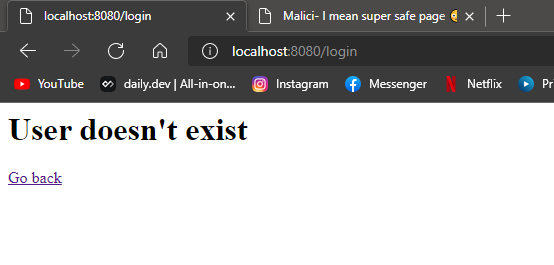

# CSRF

We made very basic custom Node.js Express apps to showcase the CSRF vulnerability. The CSRF vulnerability consists in an attacker forging a request to a website by launching it from a victim's browser. It can be use to steal or access data even protected by authentication.

## Installing the app

The app uses the monorepo technology, so only one installation is required. At the root of this directory, run:

```shell
npm install
```

## Running the app

- Run the **unsafe** application:

```shell
npm run start --workspace=malicious-website --workspace=unsafe
```

- Run the **safe** application:

```shell
npm run start --workspace=malicious-website --workspace=safe
```

## General

Before going in depth, here are a few informations. This POC is made of 3 separate apps:

- A **malicious website**, which runs on port 3000. In real life, it would obviously not be hosted on the same domain as the vulnerable website. It must run in parallel with the safe app or the unsafe app for this POC to work.

- An **unsafe server**, which runs on port 8080. It does not have any protection for CSRF attacks.

- A **safe server**, which also runs on port 8080 (the unsafe app and the safe app can obviously not run in parallel). It has protections in place agaisnt CSRF attacks.

## The unsafe server

### Base of the server

The server serves a very basic is a login page:


The API uses sessions & cookies to authenticate and requests, and it handles correctly invalid login credentials and page access.

The users database is represented as such:

|   id   | username | password    |
| :----: | -------- | ----------- |
| 7SDDyf | thibault | qwerty      |
| z4LmeT | ruben    | azerty      |
| S84EmH | morsay   | cliquez     |
| eG6Js8 | cortex   | pyramides91 |

### Point of failure

Once the user logs in correctly with the correct username and password, they get redirected to this page:


However, unbeknownst to the users, a malicious link got infiltrated onto this page:


By clicking it, the user gets redirected to this website, which doesn't appear to be doing anything:


Cool ! There is a picture of a padlock, so this site _must_ be completely secure, right ? **Wrong !** It just became your worst nightmare. 😲

Going back to the original website, we are greeted with this message:


When we try to log back in:



What ?! Let's check the server logs:


**Oh no ! We just got CSRF'd !**

But how did this happen ? There was even a padlock on the page !! 🔐

Looking at the malicious page's code, this is what we find:

```html
<iframe name="ez_csrf_iframe" style="display: none;"></iframe>
<form
  id="ez_csrf_form"
  target="ez_csrf_iframe"
  action="http://localhost:8080/delete_account"
  method="POST"
>
  <input type="hidden" id="ez_delete" name="userId" value="" />
</form>
<script>
  // On page load:
  window.onload = () => {
    // Retrieve userId value from URL parameters
    const url = new URL(window.location.href);
    const del = url.searchParams.get('delete');

    // Update form
    document.getElementById('ez_delete').value = del;

    // Submit form
    document.getElementById('ez_csrf_form').submit();
  };
</script>
```

We can see that it contains an `iframe`, with an HTML form. This form is made to retrieve our user ID from the URL parameters and then delete our account from the original website.

As just demonstrated, it works very simply and very well on unprotected websites.

## The safe server

### How to improve security ?

Nowadays, with the explosion of API servers, a lot of websites are vulnerable to some type of CSRF attack. It's a very simple but very powerful exploit that can even be done in pure HTML. Fortunately, [it can also be easily prevented](https://cheatsheetseries.owasp.org/cheatsheets/Cross-Site_Request_Forgery_Prevention_Cheat_Sheet.html), using these methods:

- Considering the `SameSite` attribute of cookies sent in incoming requests (this allows to filter out some of the requests originating from external untrusted sources),
- Utilizing CSRF tokens to identify and filter requests,
- Sometimes implementing the [Double submit cookie technique](https://cheatsheetseries.owasp.org/cheatsheets/Cross-Site_Request_Forgery_Prevention_Cheat_Sheet.html) to prevent login CSRF attacks.

### Our improvement

On the safe app, we implemented two steps to prevent CSRF attacks.

First, we added `SameSite` attribute filtering for incoming cookies, so our session setup now looks like this:

```js
// Setting up session cookies
app.use(
  session({
    name: 'sessionId',
    resave: true,
    secret: 'super_secret_secret',
    saveUninitialized: false,
    cookie: {
      maxAge: 1000 * 60 * 60 * 2,
      sameSite: true, // Filtering out requests from external sources
    },
  })
);
```

Second, we added some tried and true CSRF protection using [csurf](https://www.npmjs.com/package/csurf).

This allows us to embed a CSRF token inside forms for the client side, like this:

In the `/` route:


And in the `/user/:id` route:


And then to protect our routes by checking for the presence of a CSRF token in our POST request controllers on the server side, like this:

```js
// Adding CSRF protection to routes
app.use(csrf());
```

If the POST request contains the correct CSRF token, then the request is processed normally. If not, the request is not processed and the server sends back a code `403 Unauthorized`.

We did not implement the double submit cookie technique in this POC because it would have necessited to write an entire client application.

Let's try again to authenticate ourselves and then to click on the malicious link:


We are still logged in on the original website ! Let's check the server logs to be sure:


**Our app is protected !**


