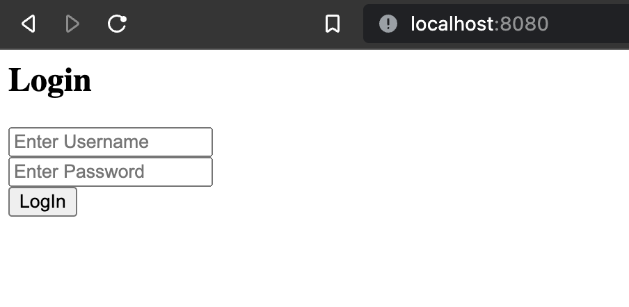
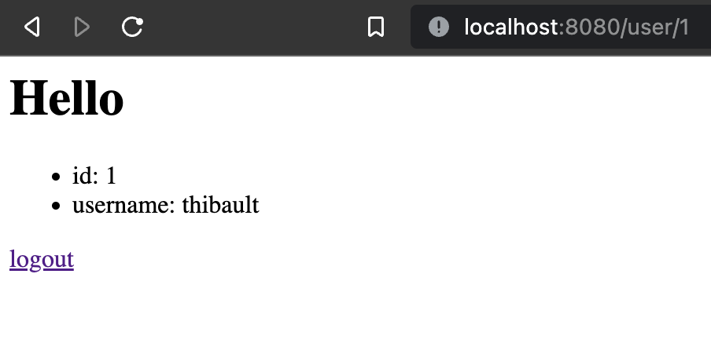
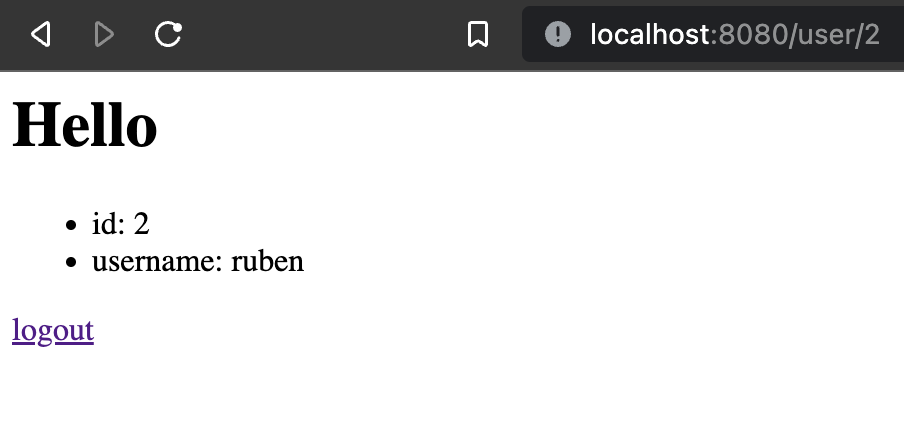
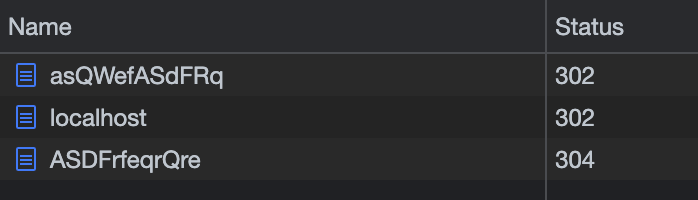

# IDOR (Insecure Direct Object Reference)

We made custom NodeJs servers to showcase the IDOR vulnerability. The IDOR vulnerability consist on accessing data that we should not be able to be fetching direction the document with no verification.

## Run the project

The project use the monorepo technologie, therefor you can run both server form the the main `package.json` file

- run the **unsafe** version

```shell
npm run start --workspace=unsafe
```

- run the **safe** version

```shell
npm run start --workspace=safe
```

## The unsafe server

### Base of the server

The server serve a classic login page



The database is represented as such:

| id  | username | password |
| :-: | -------- | -------- |
|  1  | thibault | qwerty   |
|  2  | ruben    | azerty   |

### Point of failure

Once the user log in correctly with the correct username and password. He is redirected to this page



We then can see that the path is `/user/[userid]` even without knowing what happend in the backend we can imagine that some other user would have the same page with just a different `userId`

If we try to access `/user/2`



**Banco ! You now have access to the other user data**

## The safe sever

### How to improve security ?

There is two main way to increase the security and avoid the IDOR vulneranility

- The `id` (in our exemple but any path that display data) should be a non-predictable number or string
  - using following integer can be predictable
  - using strings with too much sens as `admin` or `private` can be considered as a potential IDOR vulnerability
- The second and most important way to prevent the IDOR vulnerability is to secure those routes.
  - You may use sessions or cookies, or any other authentication

### Our improvement

For our project we have used the session as a way to make sure the user is authenticated.

And we have also changed the user's id to an random string

The new fake database beeing :

|      id      | username | password |
| :----------: | -------- | -------- |
| ASDFrfeqrQre | thibault | qwerty   |
| asQWefASdFRq | ruben    | azerty   |

With the use of session we have:

```javascript
app.get('/', (req, res) => {
  const session = req.session;
  if (session.userid) {
    res.redirect(`/user/${session.userid}`);
  } else res.sendFile('views/index.html', { root: __dirname });
});
```

Here for the `/` path we see that if the session has already been set the user is redirected to the user's page

For the user page we have this code:

```javascript
app.get('/user/:id', (req, res) => {
  const session = req.session;
  if (session.userid === req.params.id) {
    const user = users.find((u) => u.id === session.userid);
    res.send(`
      <h1>Hello</h1>
      <ul>
        <li>id: ${user.id}</li>
        <li>username: ${user.username}</li>
      </ul>
      <a href="/logout">logout</a>
    `);
  } else {
    res.redirect('/');
  }
});
```

We check if the user session match the user data he is trying to reach. And if it's not we redirect to the `/`

If the user `ASDFrfeqrQre` try to reach `/user/asQWefASdFRq` he will be redirected



**Your data is now safe**
