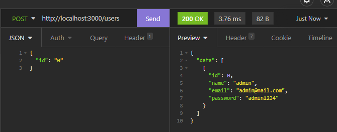
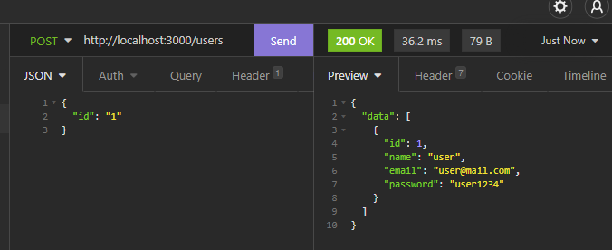
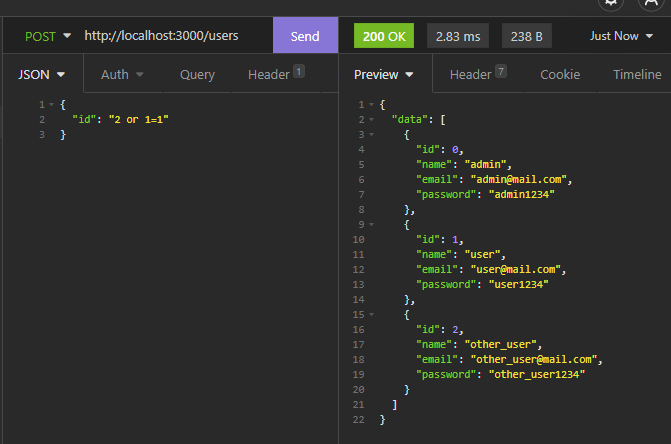
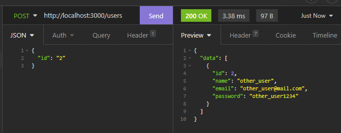
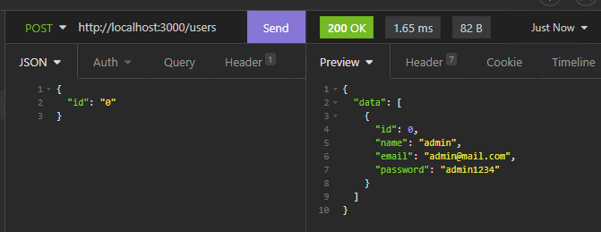
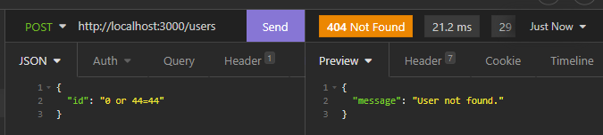

# SQL Injection

For this vulnerability we went with a very basic Node.js back-end application with a local SQLite database.

To install, go to the root of this directory and run :

```shell
npm install
```

## Run the app

- To run the **unsafe** app, just run :

```shell
npm run unsafe
```

- To run the **safe** app, just run :

```shell
npm run safe
```

Once everything is installed and the app is running, the page is accessible at this URL:

http://localhost:8080/

## Unsafe application

The unsafe app is just a very basic [express.js](https://www.npmjs.com/package/express) API, with only one endpoint : `/users`.
It looks like this:

```js
app.post("/users", async (req, res) => {
  // Retrieving the request data
  const data = req.body;

  // Constructing the SQL query to run
  const unsafeQuery = `SELECT * FROM users WHERE (id = ${data.id});`;
  // Equivalent to => 'SELECT * FROM users WHERE (id = <VALUE_OF_data.id>)'

  // Running the SQL query
  const result = await db.query(sql(unsafeQuery));

  // If the query retrieved some data,
  return result.length > 0
    ? res.status(200).json({ data: result }) // Sending back the data in teh response
    : res.status(404).json({ message: "User not found." }); // Else,
});
```

Using Insomnia, I crafted a very simple request that looks like this:




This request works very well and allows us to retrieve the data we wanted.

The vulnerability comes from this line of code:

```js
// Constructing the SQL query to run
const unsafeQuery = `SELECT * FROM users WHERE (id = ${data.id});`;
// Equivalent to => 'SELECT * FROM users WHERE (id = <VALUE_OF_data.id>)'
```

This line allows any string to be interpolated as `data.id`.

This means that we can send some SQL through the request, and that it might be executed by the server if we do it correctly.

For example, let's try this request:



As expected, we were able to perform an SQL injection on the database.

## Safe application

The unsafe app is the same very basic [express.js](https://www.npmjs.com/package/express) API as the unsafe app, with the same one endpoint : `/users`.
The route looks like this:

```js
app.post("/users", async (req, res) => {
  // Retrieving the request data
  const data = req.body;

  // Constructing the SQL query to run
  const safeQuery = sql`SELECT * FROM users WHERE (id = ${data.id});`;
  // Equivalent to => { text: 'SELECT * FROM users WHERE (id = $1)', values: [data.id] };

  // Running the SQL query
  const result = await db.query(safeQuery);

  // If the query retrieved some data,
  return result.length > 0
    ? res.status(200).json({ data: result }) // Sending back the data in teh response
    : res.status(404).json({ message: "User not found." }); // Else,
});
```

Using the same requests as for the unsafe app:




We can see that the API also works fine here. However, we've now replaced the problematic code with this line:

```js
// Constructing the SQL query to run
const safeQuery = sql`SELECT * FROM users WHERE (id = ${data.id});`;
// Equivalent to => { text: 'SELECT * FROM users WHERE (id = $1)', values: [data.id] };
```

Using the `sql` helper when building the query allows the interpolated string to be escaped to a standard SQL query string.
This means that the SQLite engine will now check (before running the query) that the type of `data.id` is the correct expected data type, and that the resulting SQL query string is sanitized.

Knowing all this, SQL injections should no longer work on the app. Let's try the same SQL injection as last time:



As expected, SQL injections do not work any longer on the app.

## Conclusion

In order to prevent SQL injections, sanitization of the SQL queries is an obligation. It allows to make sure that unwanted query strings don't get evaluated to working SQL queries.

Type checking is a good idea, as well as some data layer protection such as using the `?` variable syntax in SQL, which prevents malicious request from being concatenated into a query string.
