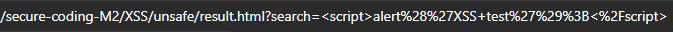
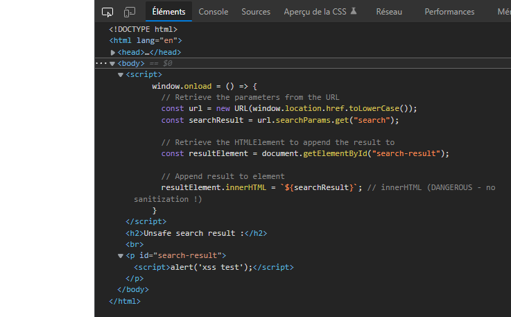
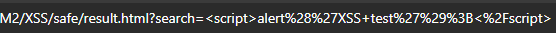
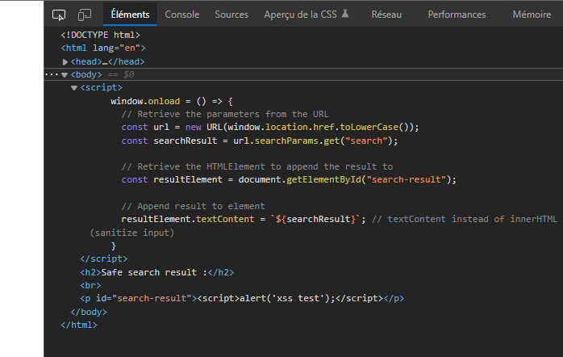

# XSS Vulnerability

We made custom files to showcase a vulnerable webpage and a non-vulnerable webpage.
We are using **reflected** XSS.

## The unsafe version

To see the unsafe webpage, _[click here](./unsafe/search.html)_.

### The search page

The **search** page is only a simple form like this :

```html
<form action="./result.html">
  <input type="search" name="search" placeholder="Your message" />
  <input type="submit" />
</form>
```

The form action sends the value of the search input as URL parameters to _[the resut.html](./unsafe/result.html)_ page.

### The result page

The **result** page is only a simple page that is meant to display the search value.

The search value is retrieved from the provided URL parameters.
This happens through a script that runs when the page loads :

```js
window.onload = () => {
  // Retrieve the parameters from the URL
  const url = new URL(window.location.href.toLowerCase());
  const searchResult = url.searchParams.get("search");

  // Retrieve the HTMLElement to append the result to
  const resultElement = document.getElementById("search-result");

  // Append result to element
  resultElement.innerHTML = `${searchResult}`; // innerHTML (DANGEROUS - no sanitization !)
};
```

The issue here come from the `innerHTML` attribute, which does not sanitize the inputs. Therefore, it only appends the raw string data without escaping any characters.

As a result, we can easily provide a malicious script through the search parameter:<br>


The malicious script is passed as URL params:<br>


As expected, the malicious script runs:<br>


This is because the malicious script was appended to the page on load:<br>


## The safe version

To see the safe webpage, _[click here](./safe/search.html)_.

### The search page

The **search** page also only contains a simple form, it is **the exact same as the unsafe search page**.

The form action still sends the value of the search input as URL parameters to _[the resut.html](./safe/result.html)_ page in the same way as for the unsafe version.

### The result page

The **result** page is only a simple page that is meant to display the search value. It is the same as fot the unsafe version, except for a slight modification to the `window.onload` script.

The search value is retrieved from the provided URL parameters.
This happens through a script that runs when the page loads :

```js
window.onload = () => {
  // Retrieve the parameters from the URL
  const url = new URL(window.location.href.toLowerCase());
  const searchResult = url.searchParams.get("search");

  // Retrieve the HTMLElement to append the result to
  const resultElement = document.getElementById("search-result");

  // Append result to element
  resultElement.textContent = `${searchResult}`; // textContent instead of innerHTML (sanitize input)
};
```

Now, the script uses `textContent` instead of `innerHTML`. The inputs are now sanitized because `textContent` escapes problematic characters to HTML character codes.

As a result, the malicious script provided through the search parameter doesn't run on the page anymore:<br>


The malicious script is still passed as URL params:<br>


As expected, the malicious script doesn't run on the page:<br>


The malicious script was still appended to the page on load, but with the characters escaped to a safe string:<br>


## Conclusion

In order to prevent reflected XSS vulnerabilities, sanitizing inputs goes a long way.

It would also help a lot to add a back-end to the web application, in order to serve safe, standardized content, and not only grab potentially malicious
parameters directly from within the browser/client.
