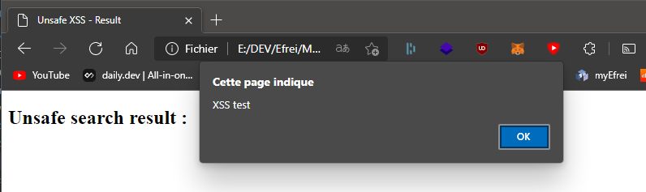

# XSS Vulnerability

We made very basic custom Node.js apps to showcase a vulnerable webpage and a non-vulnerable webpage.
Here, we are showcasing **reflected** XSS.

## Installing the app

The app uses monorepo technology, so only one installation is required.
To install, go to the root of this directory and run:

```shell
npm install
```

## Running the app

To run the **unsafe** app, at the root of this directory, just run:

```shell
npm run unsafe
```

To run the **safe** app, at the root of this directory, just run:

```shell
npm run safe
```

Once everything is installed and the app is running, the page is accessible at this URL:

http://localhost:3000/

## The unsafe version

### Base of the server

The unsafe version serves a very basic form page like this:


The form action sends the value of the search input as URL parameters to a result page.

### Point of failure

The **result** page is only a simple page that is meant to display the search value.

The search value is retrieved from the provided URL parameters, here:

```js
app.post("/result", (req, res) => {
  // Unsafe input recuperation - no sanitizing
  const displayResult = req.body.search;

  res.send(`
    <h2>Unsafe search result :</h2>
    <br>
    <p>${displayResult}</p>
  `);
});
```

The issue here comes from the direct copy of the request parameter into the result page, without sanitizing any of the inputs.
Therefore, it only appends the raw string data without escaping any characters.

As a result, we can easily provide a malicious script through the search parameter:


The malicious script is then passed in the request parameters, and as expected, the malicious script runs once the result page is loaded:



This is because the malicious script was appended to the page when the POST request was recieved by the server.

## The safe version

### How to improve security ?

When handling user inputs, it is very (very very) recommended to sanitize the inputs you recieve from your users.
This serves two purposes:

- It ensures that the data you recieve is valid, and can be used by your application without causing unexpected issues,
- It helps greatly to prevent XSS exploits on your app.

### Our improvement

On our app, we implemented input sanitization to prevent XSS attacks.

The code responsible for the vulnerability now looks like this:

```js
// Encode problematic characters to HTML code
function sanitize(string) {
  return string
    .replace(/&/g, "&amp;")
    .replace(/</g, "&lt;")
    .replace(/"/g, "&quot;");
}

app.post("/result", (req, res) => {
  // Safer input recuperation - HTML code sanitization
  const displayResult = sanitize(req.body.search);

  res.send(`
    <h2>Unsafe search result :</h2>
    <br>
    <p>${displayResult}</p>
  `);
});
```

We added a very basic function called `sanitizeHTML` which takes care of escping the HTML characters in a given string.

We then applied this function to the input we recieved from the user, and then we appended the processed string in our response.

As a result, the malicious script provided through the search parameter doesn't run on the page anymore:


As expected, the malicious script doesn't run on the page:<br>


The malicious script was still appended to the page, but it was first escaped to a safe string:.

## Conclusion

In order to prevent reflected XSS vulnerabilities, sanitizing inputs goes a long way.

It would also help a lot to add a back-end to the web application, in order to serve safe, standardized content, and not only grab potentially malicious
parameters directly from within the browser/client.
