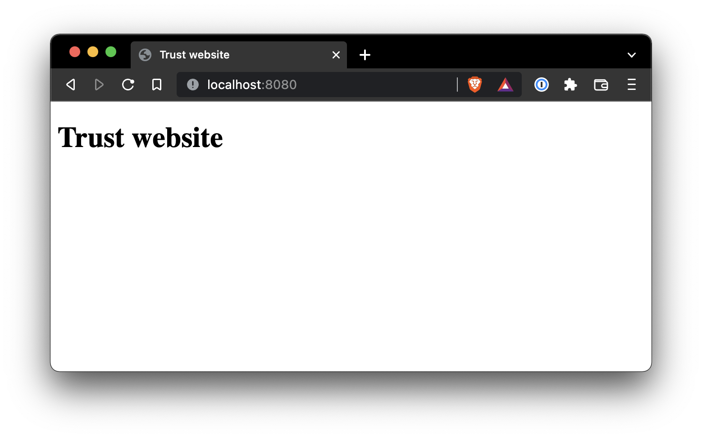

# Unvalidated redirection

## Principle

The unvalidated redirection vulneraility happen when a trusted website use a redirection without checking the destination and the redirecton location is build in the client's request.

For exemple, imagine a website that has a URL like this one

```http
https://trustedWebsite.com/login?redirect=/home
```

And the website uses the content of the query parameter to redirect the user.

An attacker could change the redirection URL to a malicious website or script by changing this param

```http
https://trustedWebsite.com/login?redirect=http://evil.com
```

And if the trusted website uses no whitelist or do not validate in any way that the redirection is ledgit then you're in trouble.

This attack is often use in conjonction with a social engineering attack and this is what we have tryed to simulate here

## Our implementation of the unvalidated redirection

### Runing our project

To simulate this attack we have used two web servers, one evil and a trusted one. Of course the trusted one has the vulnerability for one on it's endpoint.

To run the simulation you will need to run both servers

#### Running the evil server:

```bash
npm run evil
```

#### Running the trusted server:

```bash
npm run trust
```

### The simulation

Let's say that you are using you favorite website `localhost:8080`

Here is the page you are used to:



Now imagine that you recive an email


> Here it is a website but email can be html page so let say that it is an email

When you recive this email everything look normal to you and there is a simple link. You know that clicking on a link recived by email is not the safest thing to do so you check the link before.

- On the green rectangle you imediatly notice that the link will direct you to your usual `localhost:8080` trusted website. So no need to look further
- **And that's when you are wrong !!** You did not notice the last parameter in the red rectangle

If you had thak a bit more time you would have seen that the complet link URL is:

```http
http://localhost:8080/redirect?user=wefqQWEFwdqwqQwfqfq1fTGWRW$5wrgwEGHryw&randomParam=12345&url=http://localhost:6660
```

And if you remove all unnecessary parameter that were here to foul you, you can see the real redirection URL

```http
http://localhost:8080/redirect?url=http://localhost:6660
```

As your trusted website did not use a protection against unvalidated redirection your now redirect to the evil website


From now on everything is possible, the attacker could make a fake website to still your credentials of simply run a js script on your machine.

## Prevent unvalidated redirection

There is several ways to prevent the unvalidated redirection:

- Do not use forwards and redirects. (of course)
- Do not allow URLs as user input for a destination (**DO NOT TRUST THE USER**)
- Create a list of all trusted URLs, including hosts or a regex
- Force redirects to first go to a page that notify users they are redirected out of the website
