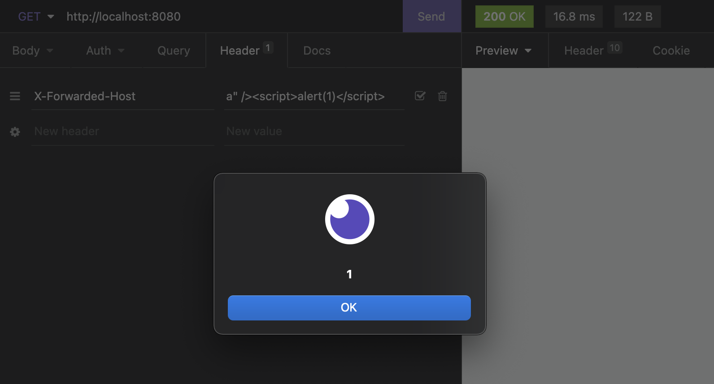
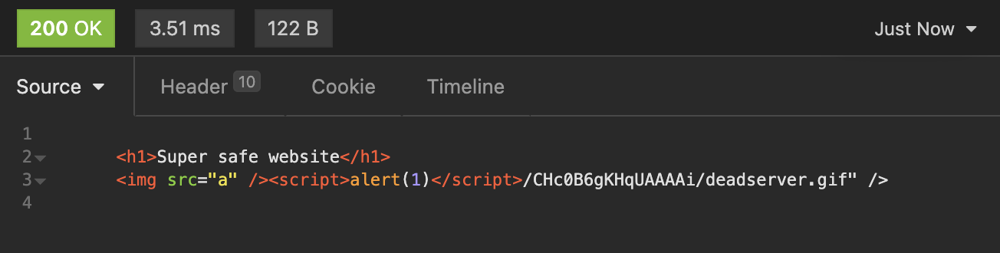
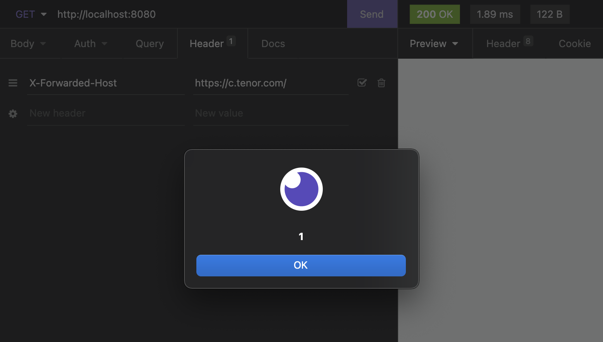

# Web cache poisoning

## Principle

The web cache poisoning consist in using the caching feature of certain servers or DNS.
Some server or DNC use cache, meaning that they will store the response of a certain request and if an other user use **the exact same** request, then it will response with the stored request and wont compute an other one.

> ℹ️ More information on this vulnerability on the [portswigger website](https://portswigger.net/web-security/web-cache-poisoning)

## Use the vulnerability

The vulnerability consist then to "upload" some maliciouse piece of code into the cached response. If your request header end up to be cached and reuse for other user you can imagine that the maliciouse code will be executed on other client.

## Our implementation of web cache poisoning

To demonstrate the vulnerability we decided to build a web server with some server-side caching

> Note that often the caching happen on the DNS side and is offten set to true by default

To do so, we use `express` and a library of in memory caching. It is of course just a server for demonstration purpose and it does not represent a probable usage of headers.

Here is the server-side caching code:

```js
const cache = (duration) => {
  return (req, res, next) => {
    const key = '__express__' + req.originalUrl || req.url;
    const cachedBody = mcache.get(key);

    if (cachedBody) {
      res.set('X-Cache', 'hit');
      res.send(cachedBody);
      return;
    } else {
      res.set('X-Cache', 'miss');
      res.sendResponse = res.send;
      res.send = (body) => {
        mcache.put(key, body, duration * 1000);
        res.sendResponse(body);
      };
      next();
    }
  };
};
```

This code take the requested url and makes it a `key`. This `key` is then associated to a response body. If an other user do the exact same request then the server will send the registered response directly.

Then we specify to our server to cache the response for the `/` URL. (It is unlikely for a real wesite)

```js
app.get('/', cache(60), (req, res) => {
  // We set an header that allow caching
  res.set('Cache-control', 'public, max-age=300');

  // We use an header variable for any reason
  const host = req.header('X-Forwarded-Host');
  res.set('X-Forwarded-Host', host);

  res.send(`
      <h1>Super safe website</h1>
      
    `);
});
```

Our code read from the user header to display some picture

> ⚠️ This is very unsafe. Once again it is only for demonstration

When accessing normally with this request:


We have this response:


Now if we try to change the request to instert malicious code we can do it by changing the value of the `X-Forwarded-Host` to `a" /><script>alert(1)</script>`

Giving us this request:


And then...



We see that the code hase been executed. We can even check the source code



We can see that the code is now in the response body

Now, what if we request the exact same URL with an other browser and a normal header.



We see that the server serv the cached response thus the one with the malicious code ! Now every user that will access this URL will be served with the malicious code.

## Who to prevent web cache poisoning

There is no real way to prevent web-cache poisoning. One solution would be to **disable caching** but it is not very realistic.

An other way to prevent problematic web cache poisoning would be to use caching only on static pages. Meaning that if a page do not use request data and always respond the same body, no web cache poisonning is possible, or more precisely no really harmin poisoning is possible.
